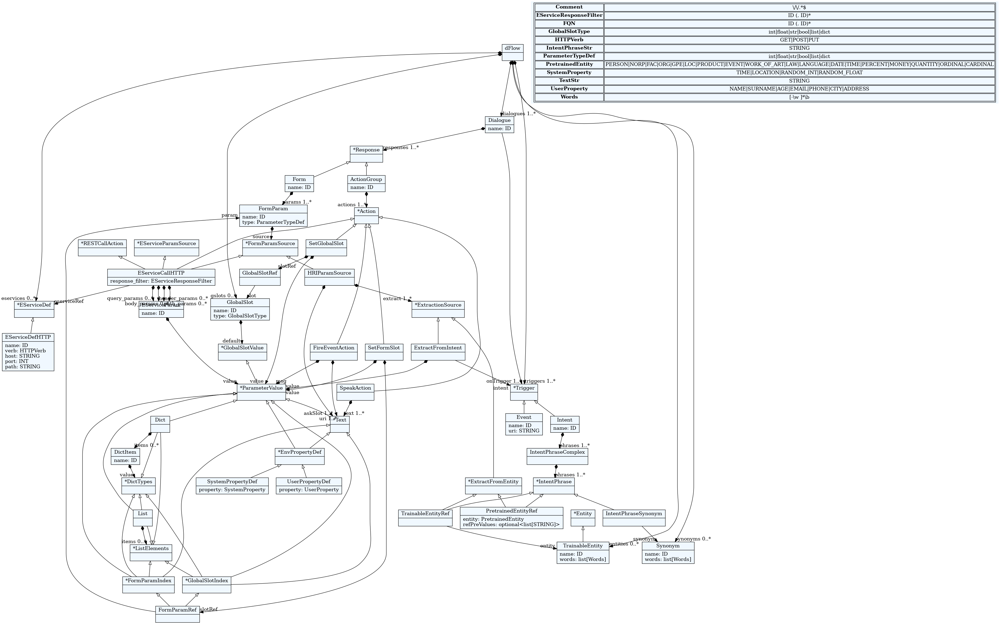

# dFlow

A Domain-Specific Language for Task-based dialogue flows suitable for Virtual Assistants in smart environments. It can generate complete [Rasa](https://rasa.com/) models.

[Task-based FSM Presentation](https://docs.google.com/presentation/d/1-cS397zUys6AUH7NB00PnPVJY91_LgPzD6LdHc6AjxY/edit#slide=id.g1217cdb7144_0_0)

[System overview](https://docs.google.com/document/d/1jlFrizaDi1PD9Rtw-TwVXaGQYwpViTWV3sUK8sJBx-c/edit)

# Metamodel

The metamodel of the DSL, defines the concepts of the language.




# Similar Work Resources

R&D:

- [A Model-based Chatbot Generation Approach to talk with Open Data Sources](https://modeling-languages.com/a-model-based-chatbot-generation-approach-to-talk-with-open-data-sources/)
- [Multi-Platform Chatbot Modeling and Deployment with the Xatkit Framework](https://modeling-languages.com/multi-platform-chatbot-modeling-deployment-xatkit/)
- [New Chatbot DSL based on state machines – Xatkit’s language is now more powerful than ever!](https://xatkit.com/chatbot-dsl-state-machines-xatkit-language/)
- [Talking to Dimensional Data Through Chatbots](https://modeling-languages.com/talking-to-dimensional-data-with-chatbots-and-nlp/)
- [Towards conversational syntax for DSLs using chatbots - miso](https://www.miso.es/pubs/ECMFA-2019.pdf)
- [Model-driven chatbot development](https://miso.es/pubs/ER20.pdf)

Platforms:

- [JAICP](https://just-ai.com/)
- [The building blocks for building chatbots](https://botpress.com/)


# TOC

- [Overview](#overview)
- [User Guide](#user-guide)
  - [Installation](#installation)
  - [Model Generation](#model-generation)
  - [Grammar](#grammar)
    - [Entities](#entities)
    - [Synonyms](#synonyms)
    - [Services](#services)
    - [Global Slots](#global-slots)
    - [Triggers](#triggers)
      - [Intents](#intents)
      - [Events](#events)
    - [Dialogues](#dialogues)
      - [Actions](#actions)
      - [Forms](#forms)
    - [Connectors](#connectors)
    - [Access Control](#access-control)
      - [Roles](#roles)
      - [Users](#users)
      - [Policies](#policies)
      - [Authentication](#authentication)
      - [Path](#path)

  - [Examples](#examples)
- [License](#license)

# Overview

# User Guide

## Installation

Download this repository and simply install using pip package manager.

```
git clone https://github.com/robotics-4-all/dFlow
cd dFlow
pip install .
```

## Model Generation

To generate a metamodel from `metamodel.dflow` file to a complete Rasa model, run the following.

```
cd dflow
textx generate metamodel.dflow --target rasa -o output_path (Default: ./gen/)
```

## Grammar

The grammar of the language has the following five attributes:

- Entities
- Synonyms
- Services
- Global Slots
- Triggers
- Dialogues

### Entities

**Entities** are structured pieces of information inside a user message. They can be real-world objects, such as a person, location, organization, product, etc. In those generic cases, there are existing *Pre-trained models* that can be used to extract entities from text and the Pre-trained Entity is defined inside the intent examples. The supported categories are imported from [spacy](https://spacy.io/models) and the relevant model has to be installed following their instructions. Example words can be given, when defined in the intents section.

In cases where the entity is domain or use-case specific such below, examples need to be given to train a new entity extractor. This is the case of a *Trainable* Entity, which is first defined and then included in the intents section.

```
Entity: TrainableEntity | PretrainedEntity;

TrainableEntity:
    'Entity' name=ID
        words+=Words[',']
    'end'
;

PretrainedEntity:
    'PERSON'        |
    'NORP'          |
    'FAC'           |
    'ORG'           |
    'GPE'           |
    'LOC'           |
    'PRODUCT'       |
    'EVENT'         |
    'WORK_OF_ART'   |
    'LAW'           |
    'LANGUAGE'      |
    'DATE'          |
    'TIME'          |
    'PERCENT'       |
    'MONEY'         |
    'QUANTITY'      |
    'ORDINAL'       |
    'CARDINAL'
;

Words:
    /[-\w ]*\b/
;
```

##### Example

```
entities
    Entity Doctor
        cardiologist,
        dentist,
        doc
    end
end
```

### Synonyms

**Synonyms** map words to a value other than the literal text extracted. They can be used when there are multiple ways users refer to the same thing. Similarly, after defined, they are incorporated in the intent examples.

```
Synonym:
    'Synonym' name=ID
        words+=Words[',']
    'end'
;
```

##### Example

```
synonyms
    Synonym date_period
        day,
        week,
        month,
        tomorrow,
        now
    end
end
```

### Services

**External services** are HTTP endpoints that can be used as part of the assistant's responses. Their url and verb are defined globally, while their parameters are specified inside the dialogue section where they are called.

```
EServiceDef: EServiceDefHTTP;

EServiceDefHTTP:
    'EServiceHTTP' name=ID
        (  'verb:' verb=HTTPVerb
          'host:' host=STRING
          ('port:' port=INT)?
          ('path:' path=STRING)?
        )#
    'end'
;

HTTPVerb:
    'GET'   |
    'POST'  |
    'PUT'
;
```

##### Example

```
eservices
    EServiceHTTP weather_svc
        verb: GET
        host: 'r4a.issel.ee.auth.gr'
        port: 8080
        path: '/weather'
    end
end
```


### Global Slots

Global slots are variables that can be accessed and modified in a global scope. 

```
GlobalSlotValue: ParameterValue;
GlobalSlotType: ParameterTypeDef;
GlobalSlotRef: slot=[GlobalSlot|FQN|^gslots];
GlobalSlotIndex: FormParamRef('['ID('.'ID)*']')?;

GlobalSlot:
    name=ID ':' type=GlobalSlotType ('=' default=GlobalSlotValue)?
;
```

##### Example
```
gslots
    slotA: int = 10,
    slotB: str = "asdas"
end
```

### Triggers

A **Trigger** initializes a dialogue flow and is either a user expression, or so called *Intent*, or an external *Event*.

`Trigger: Intent | Event;`

#### Intents

In a given user message, the thing that a user is trying to achieve or accomplish (e,g., greeting, ask for information) is called an **Intent**. An intent has a group of example user phrases with which an NLU model is trained, that consist of strings, references to Trainable Entities (TE), to Synonyms (S), and to Pretrained Entities (PE). Regarding the PEs, users can also give example words inside the brackets apart from the entity category (e.g., `PE:PERSON["John"]`).   

```
Intent:
    'Intent' name=ID
        phrases+=IntentPhraseComplex[',']
    'end'
;
IntentPhraseComplex: phrases+=IntentPhrase;

IntentPhrase:
    IntentPhraseStr |
    IntentPhraseSynonym |
    TrainableEntityRef |
    PretrainedEntityRef
;

IntentPhraseStr: STRING;

TrainableEntityRef: 'TE:' entity=[TrainableEntity|FQN|^entities*];

PretrainedEntityRef: 'PE:' entity=[PretrainedEntity|FQN|^entities*] ('[' refPreValues*=STRING[','] ']')?;

IntentPhraseSynonym: 'S:' synonym=[Synonym|FQN];
```
##### Example

In the code block below we have added a simple intent called *greet*, which contains example messages like "Hi", "Hey" and "Good morning", and a more complex *find_person* that uses all the possible references.

```
triggers
    Intent greet
        "hey",
        "hello",
        "hi",
        "good morning",
        "good evening",
        "hey there",
        "Hey",
        "Hi there",
    end
    Intent find_person
        "I want" TE:name "please",
        TE:name "please!",
        "I want to call" TE:name,
        "I want call" TE:name S:date_period,
        "call" TE:name "now",
        "I want to call" PE:PERSON "immediately",
        "call" PE:PERSON["John"] "now"
    end
end
```

#### Events

**Events** are external triggers, such as IoT events, notifications or reminders. An event is defined by its name and the URI from which it is triggered.

```
Event:
    'Event' name=ID
        uri=STRING
    'end'
;
```

##### Example

```
Event external_1
    "bot/event/external_1"
end
```

### Dialogues

**Dialogues** are conversational flows the assistant supports. They are sets of triggers and assistant responses in order and each response can be an *ActionGroup* or a *Form*.

```
Dialogue:
    'Dialogue' name=ID
        'on:' onTrigger+=[Trigger|FQN|^triggers][',']
        'responses:' responses+=Response[',']
    'end'
;

Response: ActionGroup | Form;
```

##### Example

```
dialogues
    Dialogue DialA
        on: external_1
        responses: answers
          Speak('Hello')
          Speak('Hey there')
    end

    Dialogue DialB
        on: find_doctor
        responses:
            Form AF1
                slot1: str = HRI('Give parameter 1', [PE:PERSON])
                slot2: str = HRI('Give parameter 2',
                    [find_doctor:True, external_1:False])
                slot3: str = HRI('Give parameter 3 you' AF1.slot1, [TE:Doctor])
            end,
            ActionGroup answers
              Speak('Hello' AF1.slot1 'how are you')
            end
    end
end
```

#### Actions

An action is an assistant response that can either:
- Speak a specific text (*SpeakAction*)
- Fire an Event (*FireEventAction*)
- Call an HTTP endpoint (*RESTCallAction*)
- Set a global or form slot with a specific value (*SetFSlot* and *SetGSlot*) (more on form slots in the [forms](#forms) section.)

An ActionGroup is a collection of actions that are executed sequentially.

Actions can also use real-time environment parameters, or data in general, grouped as *user* and *system* properties. User properties are user information stored locally in the device that the assistant can use, such as name, surname, age, email, phone, city and address. System properties are in-built system functions to get the current time, location, a random integer of float. That way the assistant has access to those data being device-agnostic on the same time.

```
ActionGroup:
    'ActionGroup' name=ID
        actions+=Action
    'end'
;

Action:
    SpeakAction     |
    FireEventAction |
    RESTCallAction  |
    SetFormSlot     |
    SetGlobalSlot
;

SpeakAction:
    'Speak' '(' text+=Text ')'
;

SetFormSlot:
    'SetFSlot' '(' slotRef=FormParamRef ',' value=ParameterValue ')'
;

SetGlobalSlot:
    'SetGSlot' '(' slotRef=GlobalSlotRef ',' value=ParameterValue ')'
;

FireEventAction:
    'FireEvent' '(' uri+=Text ',' msg+=Text ')'
;

RESTCallAction: EServiceCallHTTP;


EServiceCallHTTP:
    eserviceRef=[EServiceDef|FQN|eservices]'('
        (
        ('query=' '[' query_params*=EServiceParam[','] ']' ',')?
        ('header=' '[' header_params*=EServiceParam[','] ']' ',')?
        ('path=' '[' path_params*=EServiceParam[','] ']' ',')?
        ('body=' '[' body_params*=EServiceParam[','] ']' ',')?
        )#
    ')' ('[' response_filter=EServiceResponseFilter ']')?
;

EServiceParam: name=ID '=' value=ParameterValue;

ParameterValue:
    INT                 |
    FLOAT               |
    STRING              |
    BOOL                |
    List                |
    Dict                |
    EnvPropertyDef		  |
    FormParamIndex      |
    GlobalSlotIndex     |
	Text
;

ParameterTypeDef:
    'int'   |
    'float' |
    'str'   |
    'bool'  |
    'list'  |
    'dict'
;

EServiceResponseFilter: ID('.'ID)*;

DictItem:
    name=ID ':' value=DictTypes
;

DictTypes:
  NUMBER | STRING | BOOL | Dict | List | FormParamIndex | GlobalSlotIndex
;

Dict:
    '{' items*=DictItem[','] '}'
;

List:
    '[' items*=ListElements[','] ']'
;

ListElements:
    NUMBER | STRING | BOOL | List | Dict | FormParamIndex | GlobalSlotIndex
;

Text: TextStr | EnvPropertyDef | FormParamIndex | GlobalSlotIndex;

TextStr: STRING;

EnvPropertyDef: UserPropertyDef | SystemPropertyDef;
UserPropertyDef: 'USER:' property=[UserProperty|FQN];
SystemPropertyDef: 'SYSTEM:' property=[SystemProperty|FQN];

UserProperty:
    'NAME'      |
    'SURNAME'   |
    'AGE'       |
    'EMAIL'     |
    'PHONE'		  |
    'CITY'		  |
    'ADDRESS'
;

SystemProperty:
	'TIME'			  |
	'LOCATION'		|
	'RANDOM_INT'	|
	'RANDOM_FLOAT'
;
```

#### Forms

A Form is a conversational pattern to collect information and store it in form parameters or *slots* following business logic. Information can be collected via an *HRI*  interaction, in which the assistant collects the information from the user. It requests each slot using a specific text and extracts the data from the user expression. It can contain the entire processed text (the extract variable is not filled), an extracted entity, or a specific value set in case the user states a particular intent. The second choice is the *EServiceParamSource* interaction, in which the slot is filled with information received from an external service, that is defined above. Each slot is of one of the 6 types: `int`, `float`, `str`, `bool`, `list` or `dict`.

```
Form:
    'Form' name=ID
        params+=FormParam
    'end'
;

FormParam:
    name=ID ':' type=ParameterTypeDef '=' source=FormParamSource
;

FormParamRef: param=[FormParam|FQN|^dialogues*.responses.params];
FormParamIndex: FormParamRef('['ID('.'ID)*']')?;

FormParamSource: HRIParamSource | EServiceParamSource;

HRIParamSource:
    'HRI' '(' askSlot+=Text (',' '['extract+=ExtractionSource[','] ']')? ')'
;

ExtractionSource: ExtractFromEntity | ExtractFromIntent;
ExtractFromIntent: intent=[Trigger|FQN|^triggers*] ':' value=ParameterValue;
ExtractFromEntity: TrainableEntityRef | PretrainedEntityRef;

EServiceParamSource: EServiceCallHTTP;
```

### Connectors
Connectors enable the connection of the generated virtual assistants with external channels, thus allowing users to communicate with the assistant via a variety of interfaces. Until now support is provided for Slack and Telegram. Implementing a connector is the first step to establish a connection with an external channel, but further modification, specific to each vendor, may be required:
- For Slack integrations [Rasa Slack connector](https://rasa.com/docs/rasa/connectors/slack) instructions must be followed. Keep in mind that **credentials.yml** is generated automatically and further modification is optional.
- For Telegram integrations [Rasa Telegram connector](https://rasa.com/docs/rasa/connectors/telegram) instructions must be followed. Keep in mind that **credentials.yml** is generated automatically and further modification is optional.

```
Connector: Slack | Telegram;

Slack:
    ('Connector' name='slack'
        'token:' token=STRING
        'channel:' channel=STRING
        'signing_secret:' signing_secret=STRING
    'end')?
;

Telegram:
    ('Connector' name='telegram'
        'token:' token=STRING
        'verify:' verify=STRING
        'webhook_url:' webhook_url=STRING
    'end')?
;
```

##### Example
```
connectors
  Connector slack
    token: "xoxb-XXX"
    channel: "your-channel"
    signing_secret: "YYY"
  end
end
```

### Access Control
DFlow is the first DSL to support a fully functional user access control mechanism integrated into the generated bots. Using a Role-Based Access Control methodology, the bot's developer can create roles with different permissions for executing the bot's actions and assign them to users. In this way, dFlow enables the enforcement of the least privilege principle by allowing the separation of user access levels to the bot's resources. It also empowers the development of complex dialogue flows, providing the means to differentiate the bot's behavior according to the user's role.

```
AccessControlDef:
    (
    roles=Roles
    policies*=Policy
    path=Path
    (users=Users)?
    authentication=Authentication
    )#
;
```

#### Roles
Roles are granted permissions for accessing bot's actions. Each user can have one or multiple roles, inheriting all of their permissions. When defining the available roles, a **default** role should be provided, which is the role an unidentified/unauthenticated user will acquire.

```
Roles:
    'Roles'
        words+=Words[',']
        'default:'
            default=Words
    'end'
;
```

#### Users
Each role can be assigned to one or many authenticated users. Users are dinstinguished by their unique id such as their email. To see the supported identifiers check the [authentication](#authentication) section.

```
Users:
    'Users'
        roles+=UserRoles
    'end'
;
```

Users entity can be skipped if loading the user-role mappings from a file or a database is needed. This file should be specified using a [path](#path) entity. DFlow supports user-role mappings imported from text files that conform with the following JSON format:

```
{
	"role1": ["user1_identifier"],
	"role2": ["user2_identifier", "user3_identifier"],
}
```

#### Policies
Access control policies serve as the basic layer of access control. They function to enforce a permit/deny access control on ActionGroups, ensuring that only the roles explicitly declared within the policy can execute the associated ActionGroup. It's important to note that each policy is dedicated to a single ActionGroup. In cases where there is no policy assigned to a particular ActionGroup, all roles gain the ability to execute it.

```
Policy:
    'Policy' name=ID
        'on:' actions+=Words[',']
        'roles:' roles+=Words[',']
    'end'
;
```

##### Inline Policies
To enable enhanced access control capabilities, dFlow also supports inline policies. These enable the developer to control the flow of the conversation and differentiate the executed [actions](#actions) within an ActionGroup.

An inline policy example within a Dialogue is shown below:

```
 
ActionGroup inform_system_parameters
    Speak("System's HostName:" SYSTEM: HOSTNAME "\nSystem's public IP" SYSTEM: PUBLIC_IP)[roles=user_admin]
    Speak("Sorry, only admins are allowed to perform this action")[roles=user_paid]
end

```

Keep in mind that for the inline action policies to work, the user must first have access to the associated ActionGroup.

#### Authentication
For an authorization and access control mechanism to function properly, the physical users must first be assosciated with their digital identity. This is usually achieved via authentication. DFlow supports two different types of authentication schemes:

- **Third party authentication:** This allows a third party [connector](#connector) to authenticate users. The default attribute used for user identification is their **emails**, fetched from the connector's channel.

- **User ID authentication:** This allows the user to be authenticated by utilizing the _sender_id_ variable of the RASA API.

- **Slot authentication:** This allows the user to be authenticated using the content of a slot, which is filled during the conversation with the user, enabling the utilization of voice passwords.

> [!WARNING] 
> While slot authentication provides a quick solution ideal for debugging, third-party authentication is more suitable for bots intended for production environments.

```
Authentication:
    'Authentication'
        'method:' method=AuthMethods
        (
        'slot_name:' slot_name=Words
        )?
    'end'
;

AuthMethods: 'slot' | 'user_id' | 'slack' | 'telegram';
```

#### Path
User-role mappings are stored inside the file provided in the path entity. If the file doesn't exist it will be automatically generated. If no [users](#users) entity is provided, dFlow will assume that the user-role mappings already exist within this file and attempt to load them. 

```
Path:
    'Path'
        path=STRING
    'end'
;
```

### Examples

Several examples can be found [here](./examples/).

## License

This project is licensed under the [MIT License](./LICENSE).

[Back to Top](#dFlow)
